# Game Design Document

----

## Mario Dodger

### Extra Credit Additions!!!!
* There are 2 now 2 objects that follow the player around at different speeds on different levels.
* After every 2 levels, the background image will change.
* I have a `highscore.txt` that saves all high scores between program executions.
  * I also display the high scores while the game is being played.
    * High scores are only updated if you die completely... Quiting or Restarting in the middle of
      the level will not update the High Score list.
* I have added descriptions to the FollowPlayer Things and the Backgrounds below.

### Overview

* Top-down game played with the keyboard where the objective is to make it through the door on 
  the other side of the map.
* Each level, the Player starts on the left side and will recieve points by making it through the
  door on the right side.
* The amount of points recieved depends on how fast the Player completes the level as well as the
  difficulty of each level.
* However, there will be 6 different types of moving objects and 1 stationary object that are 
  placed on board that if ran into, the Player will lose a life as well as points and has to 
  restart the level.
* After each level, more and more obsticles will be placed on the board and the speed of the 
  obstacles will increase as well.
* NOTE - currently, the obstacles do NOT bounce off eachother when they collide. However, I have a 
  commented out block of code in my `GraphicWindow` class that will make them bounce off eachother.
  I believe the bouncing collisions make the game too difficult.
* After the Player loses all of his/her lives, the game is over.

### Things

1. Player
  * Moves by using the arrow keys.
  * Image:
    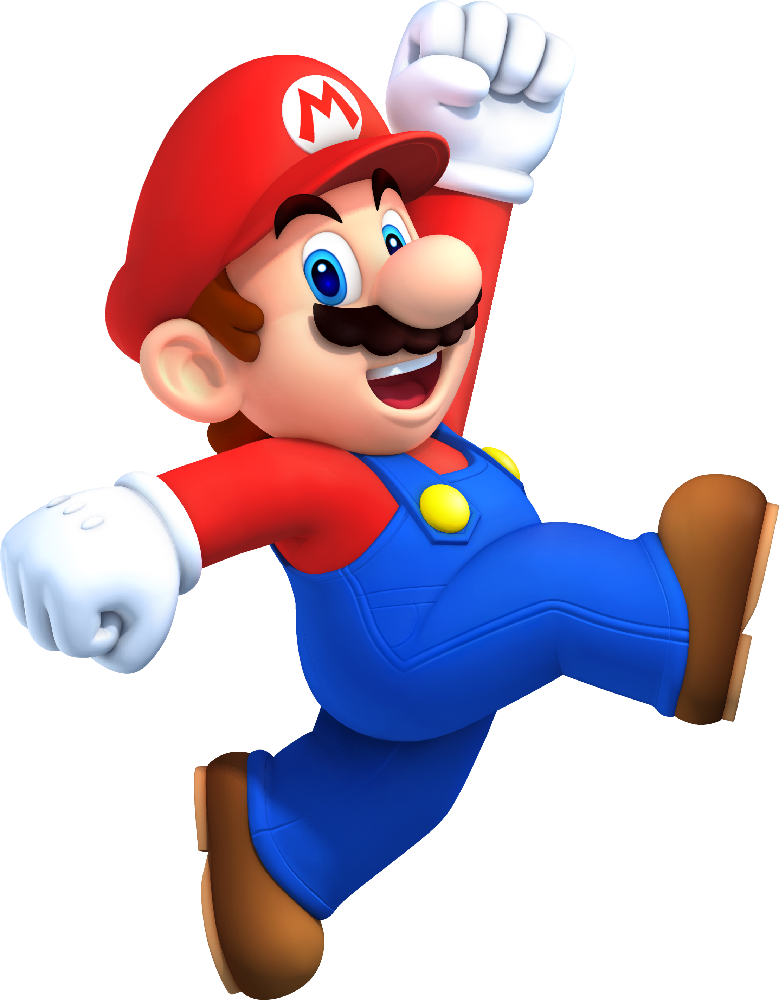

1. Stationary Obstacle
  * Is the basic obstacle.  Doesn't move.
  * Image:
    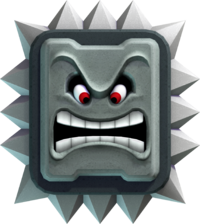
    
1. Horizontal Obstacle
  * Moves horizontally within a given range.
  * Image:
    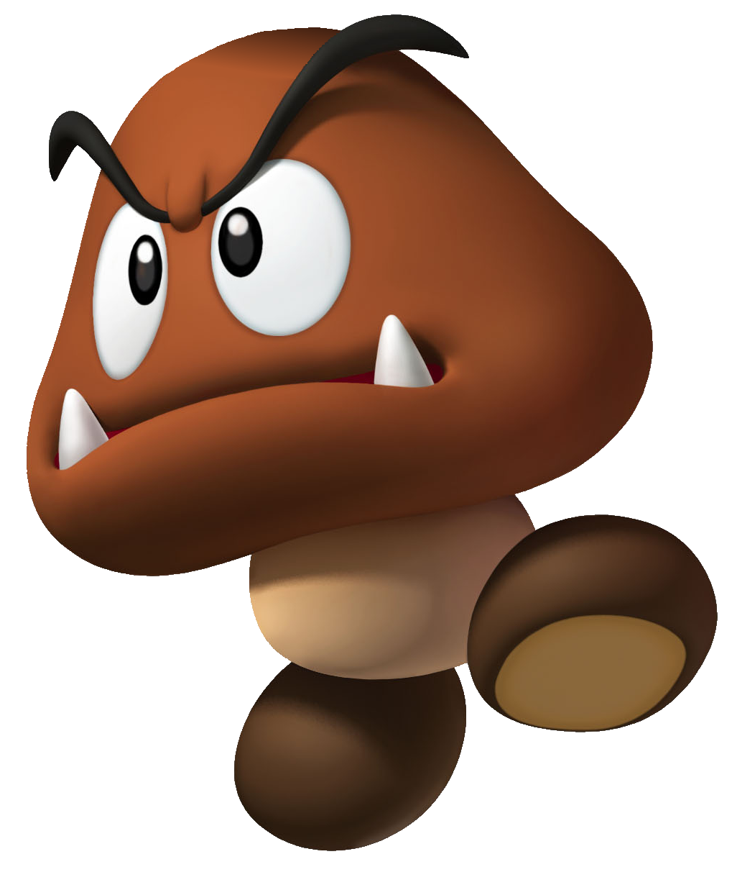
    
1. Verticle Obstacle
  * Moves vertically within a given range.
  * Image:
    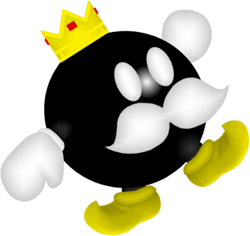

1. Lower Left to Upper Right Diagonal Obstacle
  * Moves diagonally from the lower left to the upper right corner and vice versa within a given range.
  * Image:
    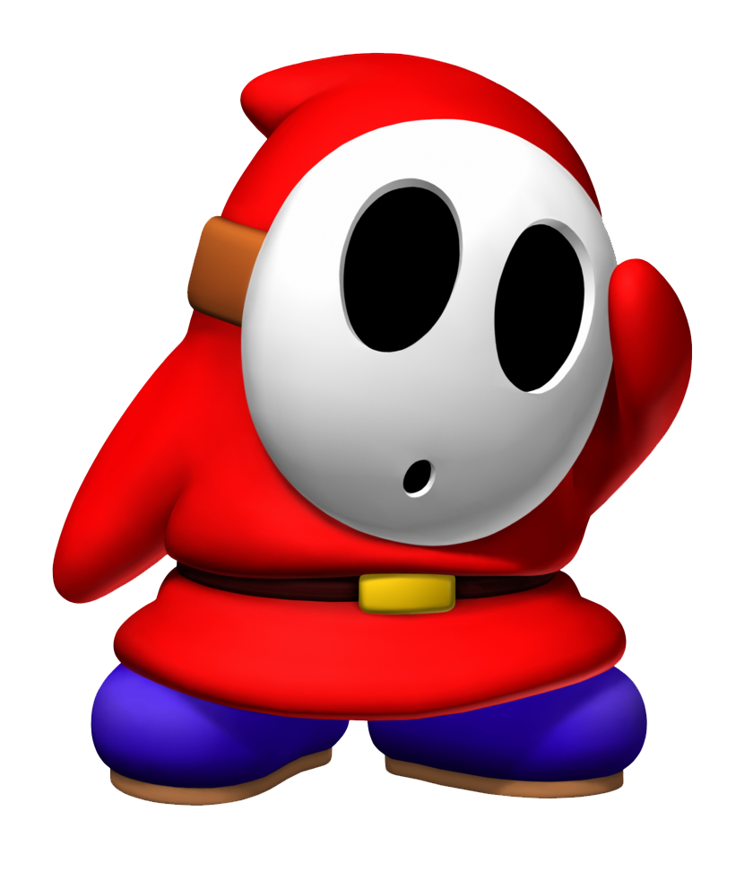

1. Lower Right to Upper Left Diagonal Obstacle
  * Moves digonally from the lower right to the upper right corner and vice versa within a given range.
  * Image:
    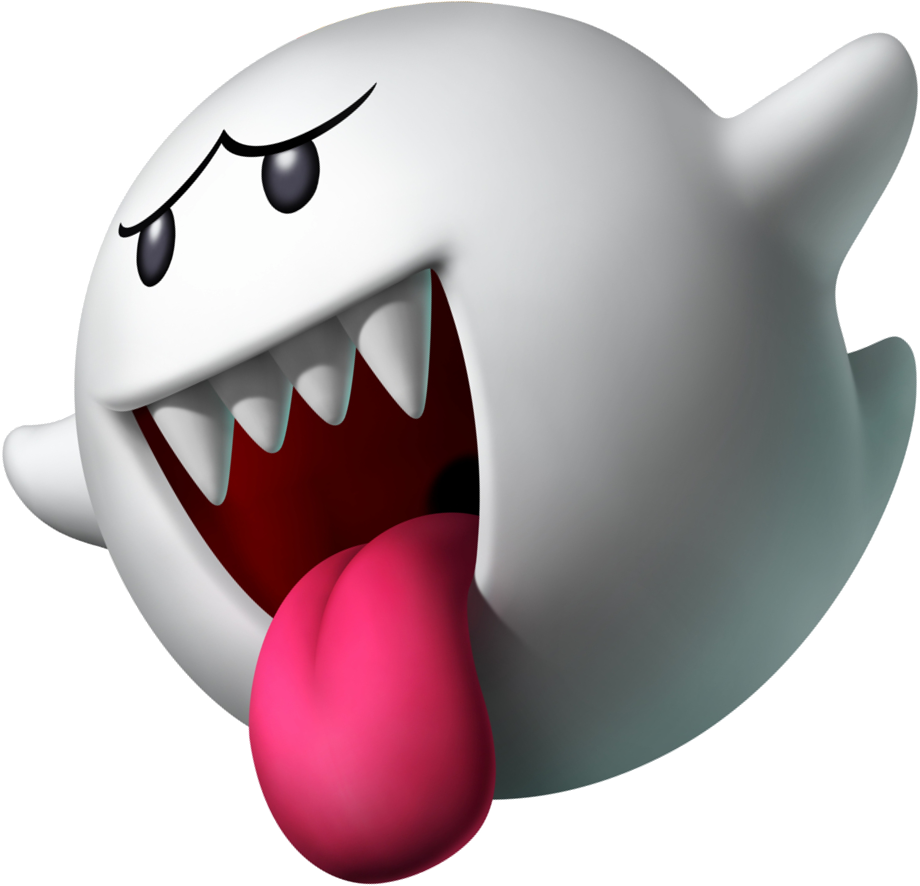
    
1. Bowser
  * Follows Mario.
  * Appears only on even levels.
  * Image:
    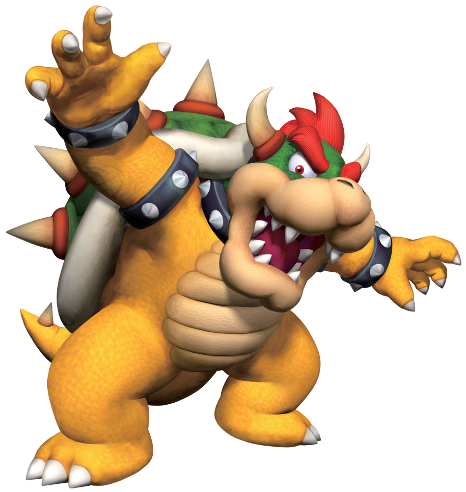

1. Donkey Kong
  * Follows Mario, but at a faster rate than Bowser.
  * Appears only every 3 levels.
  * Image:
    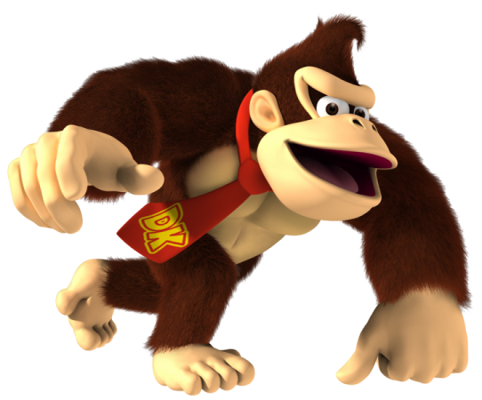

1. Background
  * 3 backgrounds of the game.
  * Will change after every 2 levels.
  * Image:
    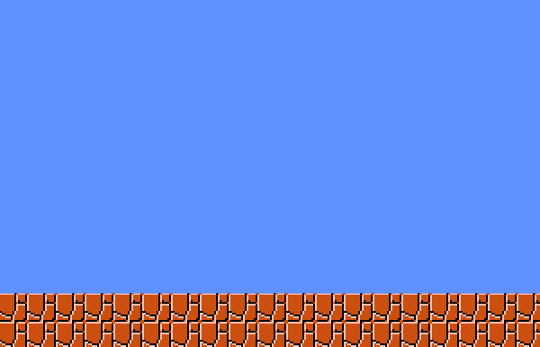
    
    

1. Gameover
  * Displays a Gameover screen.
  * Image:
    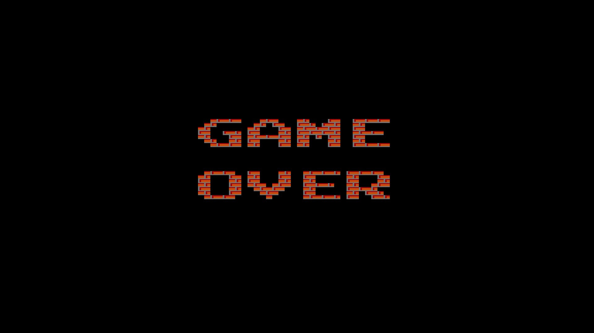

1. Instructions
  * Displays an instruction screen.
  * Image:
    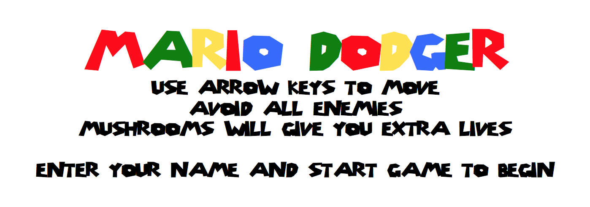

1. Mushroom
  * Will give the Player 1 extra life and 10 points.
  * Image:
    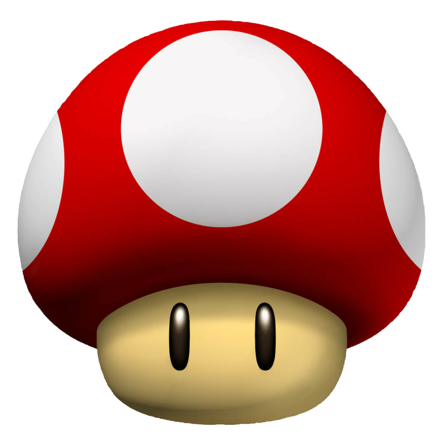

1. Megamushroom
  * Will give the Player 3 extra lives and 30 points.
  * Image:
    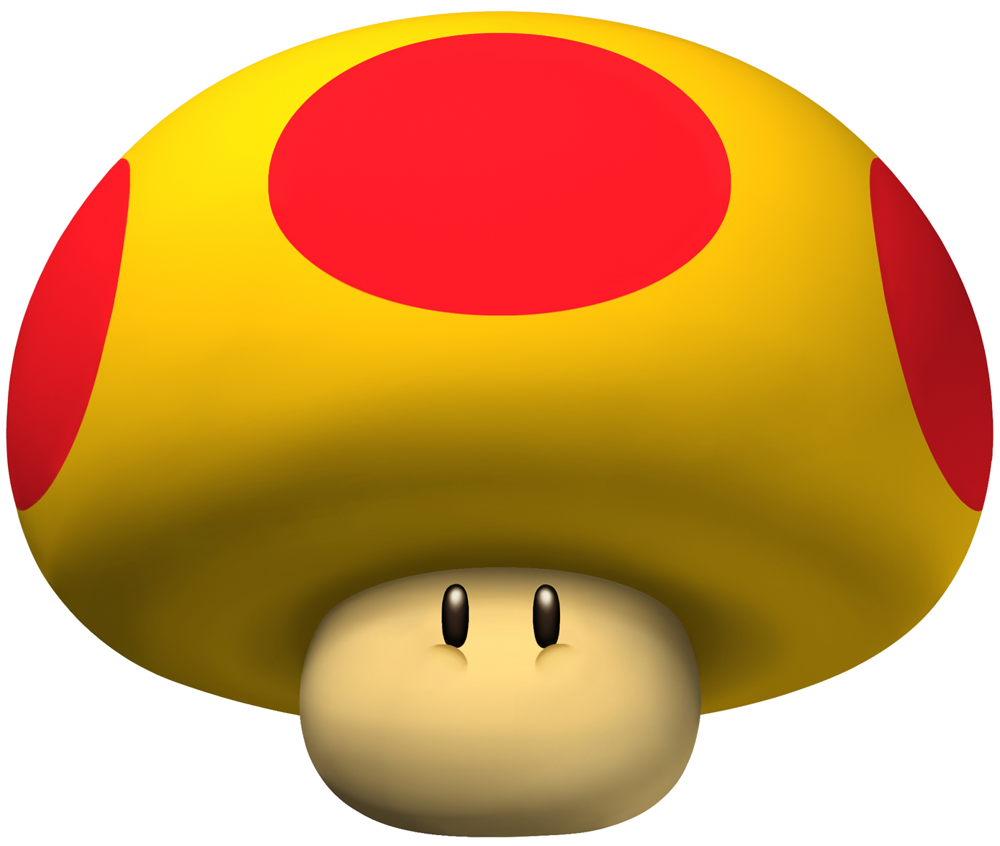

1. Tube
  * The destination to the next level.
  * Image:
    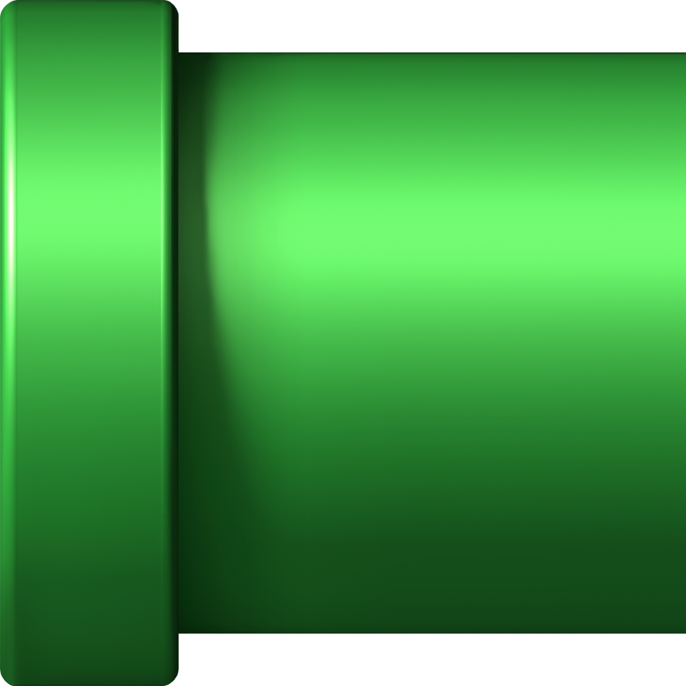
  
    
### Gameplay
* You move the Player around the board using either Arrow Keys.

### Score
* After completing each level, the Player will recieve a certain amount of points based on how fast
  the level was completed as well as the difficulty of the level.
  * The longer the time, the less points
  * The harder the level, the more points
   
### Lives
* Each Player will start with 3 lives.
* You lose a life if you collide with an obstacle.
* You can gain more lives by colliding with mushrooms.
* After you die, you will restart your current level.
* The game ends when the Player doesn't have any lives left.

### Layout
* When you first open the game, a QLineEdit will appear prompting the user to enter his/her name.
  * After the user types a name, the user will click a Start Game button
    * The name will be stored and the game window will appear.
  * I will use my FormLayout class and ToolBar class from PA4 to create this.
* I will have Start, Pause, Resume, Quit, and New Game buttons at the top of the Main Window.
  * I will use my ToolBar class from PA4 to create these 5 buttons.
* I will have 3 QLineEdits on the right side of the Main Window that will display the Player's current
  level, lives, and score.
* I will have use my GraphicWindow class from PA4 for the actual gamplay window
  * It will be the CentralWidget of my MainWindow class.

